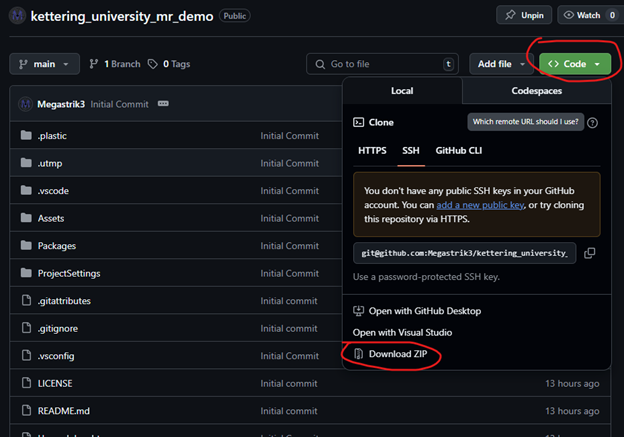
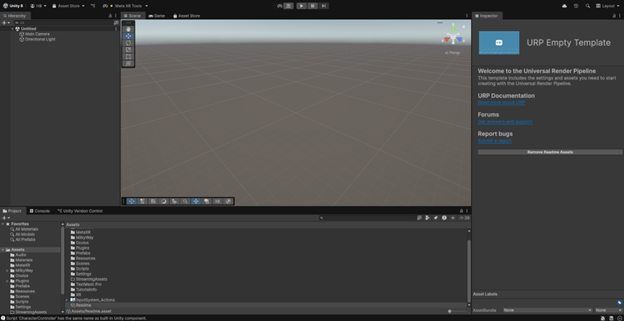
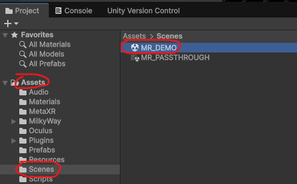
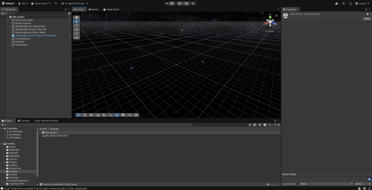
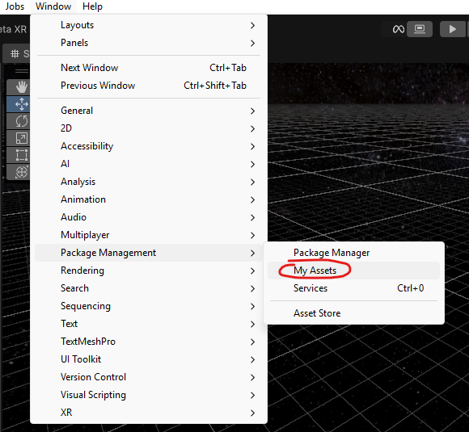
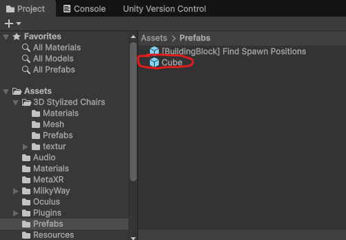
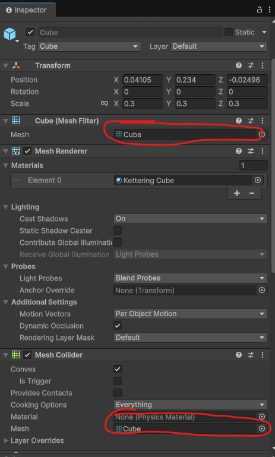
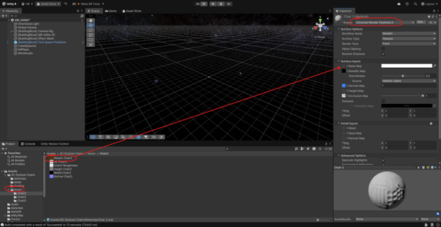

# Laboratory 3: Intro to Mixed Reality with Meta Quest 3

This laboratory exercise provides an introduction to Mixed Reality (MR) development using the Meta Quest 3. The Quest 3's advanced depth sensors and high-fidelity color cameras enable it to scan and create a real-time 3D map of the user's environment, which is fundamental for blending digital content with the real world.

This lab will guide you through downloading, running, and customizing a mixed reality Unity application to understand its core functionalities. It assumes you have successfully completed the previous lab assignments.

---

## 🎯 Concepts
* Understanding the Difference Between Mixed Reality and Augmented Reality
* Mixed Reality Development Basics in Unity

---

## 🛠️ Objectives
* Install the Mixed Reality Utility Kit (MRUK) in Unity.
* Download and run a mixed reality demo application.
* Interact with the demo application.
* Customize the demo application.

---

## 🖥️ Hardware Needed
* Oculus Quest 3
* USB-C cable (for data transfer between the Quest and your computer)

---

## 💿 Software Needed
* Oculus Link Software
* Unity Hub
* Meta Quest Mobile App

---

## 📂 Files Needed
* [Unity Demo Project](https://github.com/Kettering-University-Dev/kettering_university_mr_demo)
* A custom (and free) Unity Asset from the Unity Asset Store

---

## 📋 Procedure

Follow the procedures below to complete the lab.

### **Part 0: Quest Setup**

To use mixed reality, the Quest needs a spatial map of your environment.

1.  On your Quest, navigate to **Settings > Physical Space > Space Setup**.
2.  Select **Set up** and follow the on-screen instructions to scan your room.
3.  Ensure your space includes at least one table and one window/poster/door. If not, you can manually add them in edit mode after the scan.

### **Part 1: My Reality**

1.  Clone or download the [Unity Demo Project](https://github.com/Kettering-University-Dev/kettering_university_mr_demo) from GitHub.
    

2.  Open **Unity Hub**, click **Open > Add project from disk**, and select the `kettering_university_mr_demo` folder you just downloaded. Click the project to open it in Unity (this may take a while on the first launch).

3.  The project will open with an empty scene view.
    

4.  In the **Project** window, navigate to the `Assets/Scenes` folder and double-click the `MR_DEMO` scene to open it.
    

5.  The editor should now display the demo scene.
    

6.  Go to **File > Build Settings**.

7.  Select **Android** from the platform list and click **Switch Platform**. The Quest 3 runs on Android, so Unity needs to prepare the project for this target.

8.  After the platform switch is complete, connect your Quest to your computer. In the **Run Device** dropdown menu, select your Quest device (you may need to click **Refresh**).

9.  Click **Build and Run**. Choose a location to save the `.apk` file and give it a name. The project will now build and be deployed to your Quest.

10. Put on the headset and launch the application. You should see your real-world environment with some virtual cubes placed in it.

11. Try picking up the cubes by pinching your index finger and thumb together over a cube. You can spawn more cubes by pressing the 'B' button on your controller.

### **Part 2: Your Own Reality**

Now, let's customize the experience by replacing the default cube with a new object.

1.  Go to the **Unity Asset Store** and find a free 3D model asset. Click **Add to My Assets**.

2.  Back in the Unity Editor, go to **Window > Package Manager**.
    

3.  In the Package Manager, select the **My Assets** tab. Find the asset you just added, **Download** it, and then **Import** it into your project.

4.  In the **Project** window, navigate to `Assets/Prefabs` and click on the **Cube** prefab.
    

5.  In the **Inspector** window on the right, locate the **Mesh Filter** and **Mesh Collider** components.
    

6.  Find the folder for the asset you imported and locate its mesh file (often in a `Meshes` or `Models` folder). Drag the new mesh into the **Mesh** field for both the **Mesh Filter** and **Mesh Collider**.

7.  The preview of the object should now show your new model. To apply its texture, find the **Material** for your new asset (usually in a `Materials` folder) and drag it onto the object in the preview window.

8.  **If the object appears bright pink**, its material shader is incompatible with the project's rendering pipeline. To fix this:
    * Select the new material.
    * In the **Inspector**, click the **Shader** dropdown and select **Universal Render Pipeline > Lit**.
    * Find your asset's texture file (usually in a `Textures` folder) and drag it into the **Base Map** field.
    

9.  Follow the steps from Part 1 to **Build and Run** the application again. You can now interact with your custom object in mixed reality!

### **Part 3: Features of the MRUK**

The **Mixed Reality Utility Kit (MRUK)** is a Meta SDK that simplifies MR development in Unity. You can explore its features by clicking **Meta > MRUK > Building Blocks** in the top menu.

This demo project utilizes:
* **Camera Rig**: Essential for any VR/MR project.
* **Scene API**: Handles the creation of the 3D environmental mesh so virtual objects can interact with your real space.
* **Interaction SDK**: Allows objects to be grabbed and manipulated with hands or controllers.

Take some time to read through the documentation for these building blocks to better understand the capabilities of the Quest 3.

---

## 🤔 Post-lab Questions

1.  What did you notice about the mixed reality environment when you first launched the demo application?
2.  What could you do with the cubes? How did they interact with the environment and your body?
3.  What new asset did you choose to replace the cube with?
4.  Did this new asset interact with the environment differently than the cube?
5.  Show a picture or video of the custom asset you added.
6.  What does the **Scene API** (formerly Effect Mesh) building block do?
7.  The Scene API functions like a 3D scanner. What other applications can you envision for these environmental sensors in a mixed reality application?
8.  Of the building blocks provided by Meta, which do you think would be interesting additions to this demo application? Why?
9.  Which building blocks would you like to use in your future projects?
10. Mixed reality is a powerful feature of the Quest 3. In which engineering, automotive, or other fields do you think MR applications would have the greatest benefits? Why?
